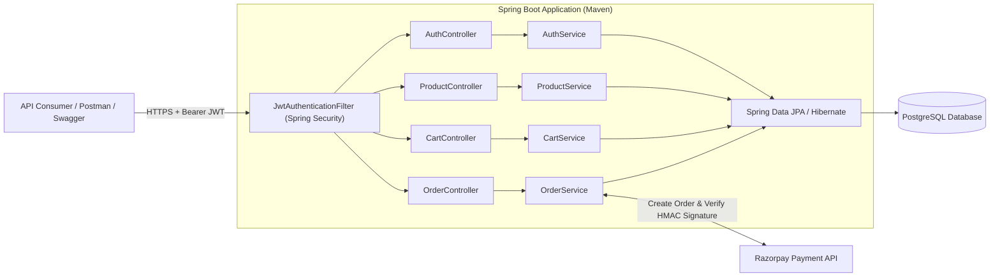

<div align="center">

# 🛒 Ecommerce Management System — Backend REST API

**Scalable E-Commerce Backend Architected with Java, Spring Boot, Hibernate / Spring Data JPA, Spring Security (JWT), PostgreSQL, Maven, and Razorpay**

[](https://openjdk.org/)
[](https://spring.io/projects/spring-boot)
[](https://hibernate.org/)
[](https://spring.io/projects/spring-security)
[](https://www.postgresql.org/)
[](https://maven.apache.org/)
[](https://razorpay.com/)
[](https://www.postman.com/)

</div>

---

## 📌 Project Overview

**Ecommerce Management System** is a production-grade, stateless **Java Spring Boot RESTful Backend** built with **Maven (`pom.xml`)**. It provides high-performance APIs for user authentication, role-based access control, dynamic multi-criteria product filtering, persistent cart management, inventory-safe order processing, real-time order milestone tracking, and **Razorpay** payment signature verification.

### ✨ Key Backend Engineering Highlights
- **Layered Architecture**: Clean separation of concerns across `Controller` $\rightarrow$ `Service` $\rightarrow$ `Repository` $\rightarrow$ `Database (PostgreSQL)` using **Spring Boot** and **Hibernate ORM**.
- **Stateless JWT Security**: Implemented `JwtAuthenticationFilter` (`OncePerRequestFilter`), HMAC-SHA256 token signing via `JwtTokenProvider`, `BCryptPasswordEncoder`, and Role-Based Access Control (`ROLE_CUSTOMER`, `ROLE_ADMIN`).
- **Dynamic Product Filtering & Pagination**: Indexed PostgreSQL tables (`idx_product_category`, `idx_product_price`) with parameterized JPQL queries supporting category, brand, price range, minimum rating, keyword search, sorting, and pagination.
- **Transactional Order Processing & Razorpay Integration**: ACID-compliant `@Transactional` order placement with automatic stock deduction, **Razorpay Order API** creation, and cryptographic HMAC-SHA256 payment signature verification.
- **Real-Time Order Tracking API**: 6-stage fulfillment state machine (`PLACED` $\rightarrow$ `CONFIRMED` $\rightarrow$ `PACKED` $\rightarrow$ `SHIPPED` $\rightarrow$ `OUT_FOR_DELIVERY` $\rightarrow$ `DELIVERED`) with courier AWB tracking metadata.

---

## 🏗️ Backend Architecture



---

## 📂 Maven Project Structure (`pom.xml`)

```text
ecommerce-management-system/
├── pom.xml
├── postman/
│   └── Ecommerce_Management_System.postman_collection.json
└── src/
    ├── main/
    │   ├── java/com/santhosh/ecommerce/
    │   │   ├── EcommerceApplication.java
    │   │   ├── controller/
    │   │   │   ├── AuthController.java
    │   │   │   ├── ProductController.java
    │   │   │   ├── CartController.java
    │   │   │   └── OrderController.java
    │   │   ├── dto/
    │   │   │   ├── AuthDtos.java
    │   │   │   └── OrderDtos.java
    │   │   ├── entity/
    │   │   │   ├── User.java
    │   │   │   ├── Category.java
    │   │   │   ├── Product.java
    │   │   │   ├── Cart.java & CartItem.java
    │   │   │   └── Order.java & OrderItem.java
    │   │   ├── exception/
    │   │   │   └── GlobalExceptionHandler.java
    │   │   ├── repository/
    │   │   │   ├── UserRepository.java
    │   │   │   ├── CategoryRepository.java
    │   │   │   ├── ProductRepository.java
    │   │   │   ├── CartRepository.java
    │   │   │   └── OrderRepository.java
    │   │   ├── security/
    │   │   │   ├── JwtTokenProvider.java
    │   │   │   ├── JwtAuthenticationFilter.java
    │   │   │   ├── CustomUserDetailsService.java
    │   │   │   └── SecurityConfig.java
    │   │   └── service/
    │   │       ├── AuthService.java
    │   │       ├── ProductService.java
    │   │       ├── CartService.java
    │   │       └── OrderService.java
    │   └── resources/
    │       └── application.yml
    └── test/
        └── java/com/santhosh/ecommerce/
            └── EcommerceApplicationTests.java
```

---

## 🔌 RESTful API Reference

| Method | Endpoint | Security | Description |
| :--- | :--- | :--- | :--- |
| `POST` | `/api/v1/auth/register` | Public | Register a new user account and issue JWT |
| `POST` | `/api/v1/auth/login` | Public | Authenticate user credentials and return Bearer JWT |
| `GET` | `/api/v1/products` | Public | Filter products by `category`, `brand`, `minPrice`, `maxPrice`, `minRating`, `keyword`, `sortBy`, `page`, `size` |
| `GET` | `/api/v1/products/{id}` | Public | Fetch product details by ID |
| `GET` | `/api/v1/categories` | Public | List all product categories |
| `POST` | `/api/v1/admin/products` | `ROLE_ADMIN` | Add a new product to catalog |
| `GET` | `/api/v1/cart` | Bearer JWT | Retrieve authenticated user's cart |
| `POST` | `/api/v1/cart/items` | Bearer JWT | Add product quantity to cart and recalculate total |
| `DELETE` | `/api/v1/cart/items/{productId}` | Bearer JWT | Remove item from cart |
| `POST` | `/api/v1/orders` | Bearer JWT | Create order, decrement inventory, and generate Razorpay Order ID |
| `POST` | `/api/v1/orders/verify-payment` | Bearer JWT | Verify Razorpay HMAC-SHA256 signature and mark order `PAID` |
| `GET` | `/api/v1/orders/my-orders` | Bearer JWT | List authenticated user's order history |
| `GET` | `/api/v1/orders/track/{orderNumber}` | Public | Retrieve real-time 6-stage order tracking timeline |
| `PATCH` | `/api/v1/orders/{orderNumber}/status` | `ROLE_ADMIN` | Update order fulfillment status |

---

## 🚀 Build & Run with Maven

```bash
git clone https://github.com/SanthoshBussa/ecommerce-management-system.git
cd ecommerce-management-system
mvn spring-boot:run
```
- **REST API Base URL**: `http://localhost:8080/api/v1`
- **Postman Collection**: Import [`postman/Ecommerce_Management_System.postman_collection.json`](./postman/Ecommerce_Management_System.postman_collection.json) into Postman.

---

## 👨‍💻 Author

**Santhosh Bussa** — *Java Backend Developer (1.6+ Years Experience)*
- 📍 Location: Bangalore, Karnataka, India
- 🌐 Portfolio: [santhosh-bussa-portfolio.onrender.com](https://santhosh-bussa-portfolio.onrender.com)
- 💼 LinkedIn: [linkedin.com/in/santhosh-bussa](https://www.linkedin.com/in/santhosh-bussa)
- 🐙 GitHub: [github.com/SanthoshBussa](https://github.com/SanthoshBussa)
- 📧 Email: [iamsanthoshbussa@gmail.com](mailto:iamsanthoshbussa@gmail.com)
