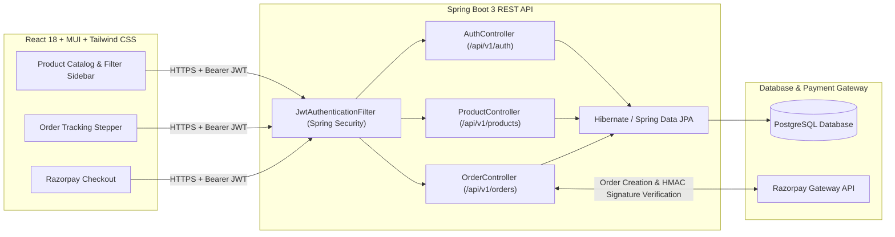

<div align="center">

# 🛒 Ecommerce Management System

**Full-Stack Scalable E-Commerce Platform built with Java, Spring Boot, Spring Security (JWT), PostgreSQL, React, Material-UI (MUI), Tailwind CSS, and Razorpay**

[](https://openjdk.org/)
[](https://spring.io/projects/spring-boot)
[](https://spring.io/projects/spring-security)
[](https://www.postgresql.org/)
[](https://react.dev/)
[](https://mui.com/)
[](https://tailwindcss.com/)
[](https://razorpay.com/)

</div>

---

## 📌 Overview

The **Ecommerce Management System** is an end-to-end full-stack application architected for scalable product catalog browsing, multi-criteria filtering, stateless JWT-secured authentication, inventory-safe order processing, Razorpay payment verification, and real-time order milestone tracking.

### ✨ Key Highlights
- **Scalable RESTful Backend**: Designed clean layered architecture (`Controller` $\rightarrow$ `Service` $\rightarrow$ `Repository` $\rightarrow$ `PostgreSQL`) using **Spring Boot 3** and **Hibernate / Spring Data JPA**.
- **Stateless JWT Security**: Integrated **Spring Security** with custom `OncePerRequestFilter` (`JwtAuthenticationFilter`), `BCrypt` password hashing, and Role-Based Access Control (`ROLE_CUSTOMER`, `ROLE_ADMIN`).
- **Dynamic Product Filtering & Sorting**: Parameterized JPQL queries supporting combined filters by category, brand, price range, customer rating, keyword search, and pagination.
- **End-to-End Order & Payment Workflow**: Automated stock validation, **Razorpay** order creation, HMAC-SHA256 payment signature verification, and 6-stage real-time order tracking (`PLACED` $\rightarrow$ `CONFIRMED` $\rightarrow$ `PACKED` $\rightarrow$ `SHIPPED` $\rightarrow$ `OUT_FOR_DELIVERY` $\rightarrow$ `DELIVERED`).
- **Responsive React Frontend**: Built with **React 18**, **Material-UI (MUI)** components (`Stepper`, `Slider`, `Rating`, `Pagination`), and **Tailwind CSS**.

---

## 🏗️ System Architecture



---

## 📂 Project Structure

```text
ecommerce-management-system/
├── backend/                                 # Java 17 + Spring Boot 3 Backend
│   ├── pom.xml                              # Maven dependencies (Web, JPA, Security, JWT, Razorpay, PostgreSQL)
│   └── src/
│       ├── main/java/com/santhosh/ecommerce/
│       │   ├── controller/                  # REST Controllers (AuthController, ProductController, OrderController)
│       │   ├── dto/                         # Request/Response DTOs with Jakarta Bean Validation
│       │   ├── entity/                      # JPA Entities (User, Product, Category, Order, OrderItem)
│       │   ├── exception/                   # GlobalExceptionHandler (@RestControllerAdvice)
│       │   ├── repository/                  # Spring Data JPA Repositories with custom JPQL filtering
│       │   ├── security/                    # JwtTokenProvider, JwtAuthenticationFilter, SecurityConfig
│       │   └── service/                     # Business Logic & Razorpay Integration
│       ├── main/resources/
│       │   └── application.yml              # PostgreSQL, Hibernate, JWT & Razorpay config
│       └── test/java/com/santhosh/ecommerce/
│           └── EcommerceApplicationTests.java
├── frontend/                                # React 18 + Vite + MUI + Tailwind CSS Frontend
│   ├── package.json
│   ├── tailwind.config.js
│   └── src/
│       ├── api/axiosClient.js               # Axios instance with JWT Bearer token interceptor
│       ├── pages/
│       │   ├── ProductCatalogPage.jsx       # Multi-criteria product filtering, search & pagination
│       │   └── OrderTrackingPage.jsx        # Real-time 6-stage order tracking UI
│       └── App.jsx
└── postman/
    └── Ecommerce_Management_System.postman_collection.json
```

---

## 🔌 REST API Endpoints

| Method | Endpoint | Access | Description |
| :--- | :--- | :--- | :--- |
| `POST` | `/api/v1/auth/register` | Public | Register a new customer account and return JWT |
| `POST` | `/api/v1/auth/login` | Public | Authenticate user credentials and issue JWT |
| `GET` | `/api/v1/products` | Public | Filter products by `category`, `brand`, `minPrice`, `maxPrice`, `minRating`, `keyword`, `sortBy`, `page` |
| `GET` | `/api/v1/products/{id}` | Public | Retrieve single product details |
| `GET` | `/api/v1/categories` | Public | List all product categories |
| `POST` | `/api/v1/admin/products` | `ROLE_ADMIN` | Create a new product in catalog |
| `POST` | `/api/v1/orders` | Authenticated | Place order, reserve stock, and generate Razorpay Order ID |
| `POST` | `/api/v1/orders/verify-payment` | Authenticated | Verify Razorpay HMAC-SHA256 payment signature |
| `GET` | `/api/v1/orders/my-orders` | Authenticated | Get logged-in customer's order history |
| `GET` | `/api/v1/orders/track/{orderNumber}` | Public | Track real-time order shipment status & timeline |
| `PATCH` | `/api/v1/orders/{orderNumber}/status` | `ROLE_ADMIN` | Update order fulfillment status |

---

## 🚀 Getting Started

### Prerequisites
- **Java 17+** & **Maven 3.8+**
- **PostgreSQL 14+**
- **Node.js 18+** & **npm**

### 1️⃣ Backend Setup (Spring Boot + PostgreSQL)

1. Create a PostgreSQL database:
   ```sql
   CREATE DATABASE ecommerce_db;
   ```
2. Configure environment variables (or update `backend/src/main/resources/application.yml`):
   ```bash
   export DB_URL=jdbc:postgresql://localhost:5432/ecommerce_db
   export DB_USERNAME=postgres
   export DB_PASSWORD=postgres
   export RAZORPAY_KEY_ID=rzp_test_yourKeyId
   export RAZORPAY_KEY_SECRET=yourKeySecret
   ```
3. Run the Spring Boot server:
   ```bash
   cd backend
   mvn clean spring-boot:run
   ```
   The backend API will start at `http://localhost:8080`.

### 2️⃣ Frontend Setup (React + MUI + Tailwind CSS)

```bash
cd frontend
npm install
npm run dev
```
The React client will start at `http://localhost:5173`.

### 3️⃣ API Testing with Postman
Import [`postman/Ecommerce_Management_System.postman_collection.json`](./postman/Ecommerce_Management_System.postman_collection.json) into **Postman** to test authentication, dynamic product filtering, order creation, and payment verification.

---

## 👨‍💻 Author

**Santhosh Bussa** — *Java Developer*
- 💼 LinkedIn: [linkedin.com/in/santhosh-bussa](https://www.linkedin.com/in/santhosh-bussa)
- 🐙 GitHub: [github.com/SanthoshBussa](https://github.com/SanthoshBussa)
- 📧 Email: [iamsanthoshbussa@gmail.com](mailto:iamsanthoshbussa@gmail.com)
